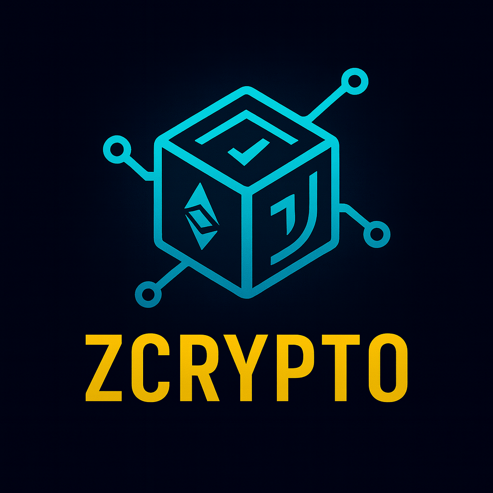

<p align="center">
  
</p>

<p align="center">
  
  
  
  
  
  
</p>

# Zcrypto: A Modern Cryptography Library for Zig

**Zcrypto** is a modular cryptography library written in Zig. The stable release centers on the core primitives, QUIC helpers, and feature-gated transport/runtime integrations that are currently verified in this repository.

---

## 🛡️ Core Principles

⚠️ **Mixed Stability Surface** ⚠️
The core API in this release is intended to be stable. Several optional modules remain experimental and require explicit build-time opt-in via `-Dexperimental-crypto=true`.

* **Memory-safe by design:** Leveraging Zig's explicit control and compile-time safety features.
* **Modular architecture:** Enable only the features you need with build-time flags.
* **Audit-friendly:** Easy to read, easy to verify. Minimal dependencies.
* **Cross-platform:** Works seamlessly on Linux, macOS, Windows, and embedded targets.
* **Complements Zig std.crypto:** Zig now offers crypto functionality in its standard library; this library provides additional blockchain-specific and experimental features.

---

## ⚙️ Modular Features

Zcrypto supports selective compilation with feature flags:

| Feature | Size | Description |
|---------|------|-------------|
| **Core** | ~3MB | Hash, symmetric crypto, signatures, key exchange |
| **+ TLS/QUIC** | +8MB | TLS 1.3, QUIC crypto, X.509 certificates |
| **+ Post-Quantum** | +5MB | Experimental ML-KEM / ML-DSA APIs |
| **+ Hardware Accel** | +2MB | AES-NI, AVX2, SIMD optimizations |
| **+ Blockchain** | +3MB | Experimental blockchain helpers |
| **+ VPN** | +4MB | WireGuard, IPsec, IKEv2 protocols |
| **+ Enterprise** | +3MB | Experimental HSM / formal-analysis helpers |
| **+ ZKP** | +6MB | Experimental zero-knowledge proof APIs |
| **+ Async** | +2MB | Async crypto with zsync integration |

**Build Size Examples:**
- Embedded/IoT: ~3MB (core only)
- Web server: ~12MB (core + TLS + async)
- Blockchain node: ~18MB (core + blockchain + ZKP + hardware)
- Full-featured: ~35MB (all features)

---

## 🤖 Algorithms & Primitives

### ✔️ Core (Always Available)

* **Hashing:** SHA-256, SHA-512, Blake2b/3, SHAKE-128
* **Symmetric:** AES-256-GCM, ChaCha20-Poly1305
* **Asymmetric:** Ed25519, X25519, Secp256r1 ECDH
* **Key Derivation:** HKDF, PBKDF2, BIP39
* **Random:** CSPRNG with hardware entropy
* **Batch Operations:** Multi-signature verification

### 🔧 Optional Features

* **TLS/QUIC** - QUIC helpers and TLS-related utilities
* **Post-Quantum** - Experimental ML-KEM and ML-DSA APIs
* **Hardware Acceleration** - AES-NI, AVX2, SIMD optimizations
* **Blockchain** - Experimental blockchain-oriented helpers
* **VPN** - WireGuard, IPsec, IKEv2 protocol implementations
* **WebAssembly** - Browser-compatible crypto operations
* **Enterprise** - Experimental HSM and analysis helpers
* **Zero-Knowledge Proofs** - Experimental proof-system APIs
* **Async Operations** - Concurrent crypto with zsync runtime

---

## 🚀 Quick Start

Current toolchain baseline: Zig `0.17.0-dev.9+046002d1a`.

### Installation

```bash
zig fetch --save https://github.com/ghostkellz/zcrypto/archive/refs/tags/v1.0.2.tar.gz
```

### Basic Usage (Core Only)

```zig
const zcrypto = @import("zcrypto");

// Hashing
const hash = zcrypto.hash.sha256("Hello, zcrypto!");
std.debug.print("SHA-256: {x}\n", .{std.fmt.fmtSliceHexLower(&hash)});

// Encryption
const key = [_]u8{0x01} ** 32;
const encrypted = try zcrypto.sym.encryptAesGcm(allocator, "secret", &key);
defer allocator.free(encrypted);
const decrypted = try zcrypto.sym.decryptAesGcm(allocator, encrypted, &key);
defer allocator.free(decrypted);

// Signatures
const keypair = zcrypto.asym.ed25519.generate();
const signature = try zcrypto.asym.signEd25519("message", keypair.private_key);
const valid = zcrypto.asym.verifyEd25519("message", signature, keypair.public_key);
```

### Modular Build Configuration

```zig
// build.zig
const zcrypto = b.lazyDependency("zcrypto", .{
    .target = target,
    .optimize = optimize,
    // Enable only needed features
    .tls = true,
    .@"post-quantum" = false,
    .@"hardware-accel" = true,
    // Other features default to false
});

exe.root_module.addImport("zcrypto", zcrypto.module("zcrypto"));
```

---

## 📚 Documentation

- **[Quick Start](docs/getting-started/quick-start.md)** - Get started in minutes
- **[Build Configuration](docs/getting-started/build-config.md)** - Feature flags and optimization
- **[API Reference](docs/api/core.md)** - Stable core API documentation
- **[Features](docs/features/README.md)** - Optional feature guides
- **[Examples](docs/examples/README.md)** - Working code examples
- **[Contributing](docs/contributing/README.md)** - Development guidelines

---

## 🔍 Example Projects

```bash
# Build the default targets
zig build

# Run the demo
zig build run

# Run the advanced example with PQ + hardware enabled
zig build run-advanced -Dpost-quantum=true -Dexperimental-crypto=true -Dhardware-accel=true
```

---

## ⚖️ Use Cases

* **Embedded/IoT:** Core crypto in ~3MB binaries
* **Web Services:** TLS + async for secure APIs
* **Blockchain Research:** Experimental helpers with explicit opt-in
* **VPN Servers:** Complete protocol implementations
* **Enterprise Research:** Experimental HSM and verification helpers
* **Privacy Research:** Experimental post-quantum and proof-system APIs

---

## 🚀 Roadmap

### ✅ Completed
* ✅ Modular build system with 9 feature flags
* ✅ 70-91% binary size reduction for selective builds
* ✅ Structured documentation in `docs/` directory
* ✅ Hardware acceleration (AES-NI, AVX2, SIMD)
* ✅ Stable core primitives and feature-gated build system
* ✅ QUIC helpers and TLS-related support code
* ✅ Honest separation between stable and experimental surfaces

### 🔮 Future Plans
* [ ] Additional post-quantum schemes (Falcon, SPHINCS+)
* [ ] More hardware acceleration (ARM NEON, RISC-V vectors)
* [ ] Formal verification integration
* [ ] WebAssembly optimizations
* [ ] Additional blockchain protocols

---

## 📊 Performance

* **Compilation:** 45s → 12s (70% faster with selective features)
* **Binary Size:** 35MB → 3MB (91% reduction for embedded)
* **Runtime:** Competitive with RustCrypto, OpenSSL
* **Memory:** Zero dynamic allocation in core primitives
* **Hardware:** 2-10x speedup with acceleration enabled

---

## ✨ License

MIT or dual MIT/Apache2 for maximum compatibility.

---

**Zcrypto**: Modular cryptography at the speed of Zig.
