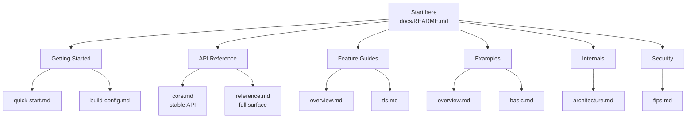
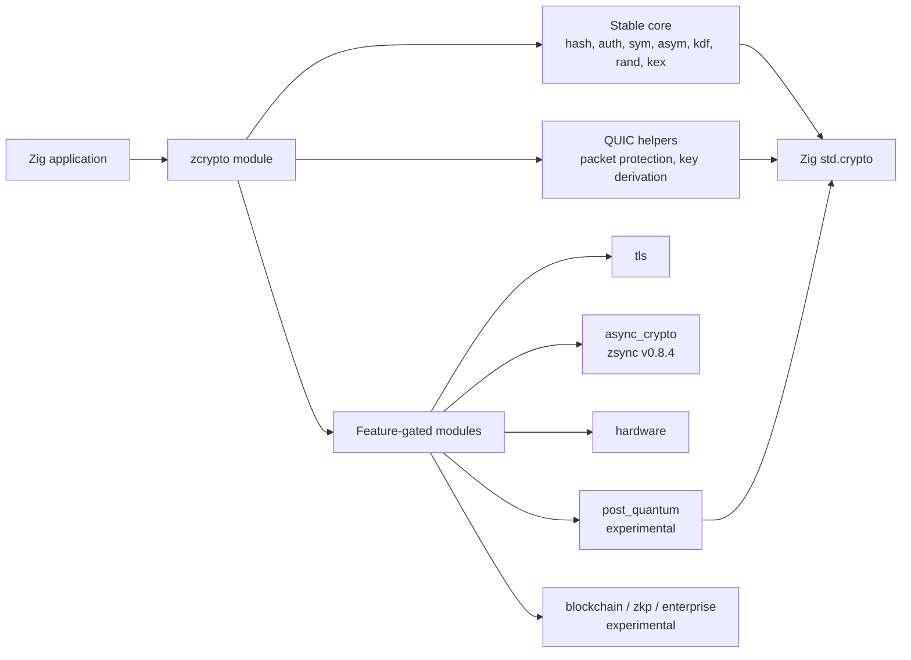
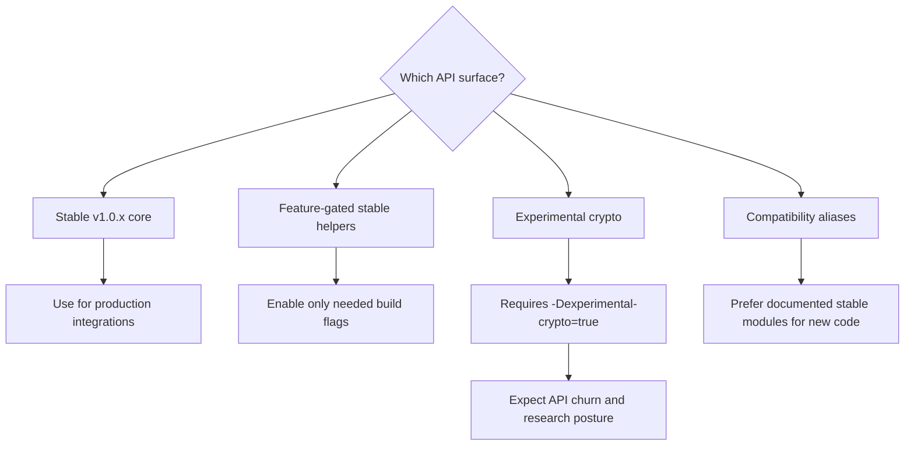
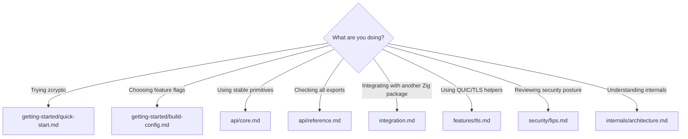

# zcrypto Documentation

zcrypto is a modular cryptography library for Zig. The v1.0.x documentation is
organized around a stable core API, explicit feature gates, and clear separation
between production-ready primitives and experimental research surfaces.

## Documentation Map

## Runtime Shape

## Stability Model

## Common Paths

## Getting Started

- [Quick Start](getting-started/quick-start.md) - Install and use the stable core APIs.
- [Build Configuration](getting-started/build-config.md) - Feature flags, dependency shape, and example package configurations.

## API Reference

- [Core API](api/core.md) - Stable hash, authentication, symmetric, asymmetric, KDF, random, KEX, and ownership rules.
- [Full Reference](api/reference.md) - Stable, feature-gated, experimental, FFI, and build-aware exports.

## Feature Guides

- [Feature Overview](features/overview.md) - Feature flags, dependencies, stability notes, and use-case configurations.
- [TLS/QUIC](features/tls.md) - TLS-related helpers and QUIC crypto building blocks.

## Examples

- [Examples Overview](examples/overview.md) - Repository examples and what each one demonstrates.
- [Basic Usage](examples/basic.md) - Hashing, AEAD, signatures, KDF, and random examples.

## Internals

- [Architecture](internals/architecture.md) - Module graph, build graph, request/key flows, and downstream boundaries.

## Security

- [FIPS Posture](security/fips.md) - Approved, experimental, and unsupported algorithms.
- [Security Policy](../SECURITY.md) - Reporting vulnerabilities and supported release line.

## Quick Links

| Area | Path |
|------|------|
| Package metadata | [`../build.zig.zon`](../build.zig.zon) |
| Build script | [`../build.zig`](../build.zig) |
| Stable root module | [`../src/root.zig`](../src/root.zig) |
| Release notes | [`../CHANGELOG.md`](../CHANGELOG.md) |
| Contributing | [`../CONTRIBUTING.md`](../CONTRIBUTING.md) |

## Production Checklist

- Keep production code on the stable core plus documented QUIC helpers unless a feature gate is intentional.
- Enable only the features your consumer needs.
- Require `-Dexperimental-crypto=true` for PQ, blockchain, enterprise/formal, and ZKP surfaces.
- Treat ML-KEM and ML-DSA wrappers as useful but still experimental in v1.0.x.
- Query FFI/runtime capabilities instead of assuming optional feature symbols exist.
- Preserve allocator ownership: returned slices from allocator-taking APIs are caller-owned unless a `deinit` method is documented.
