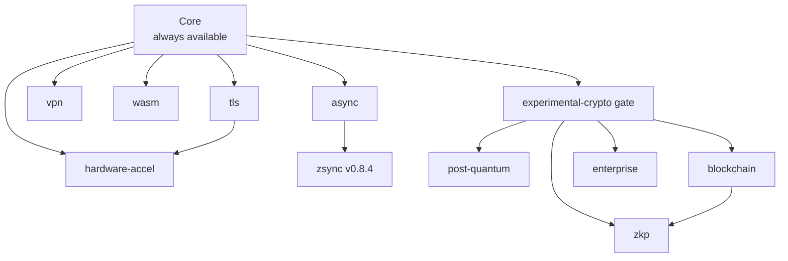
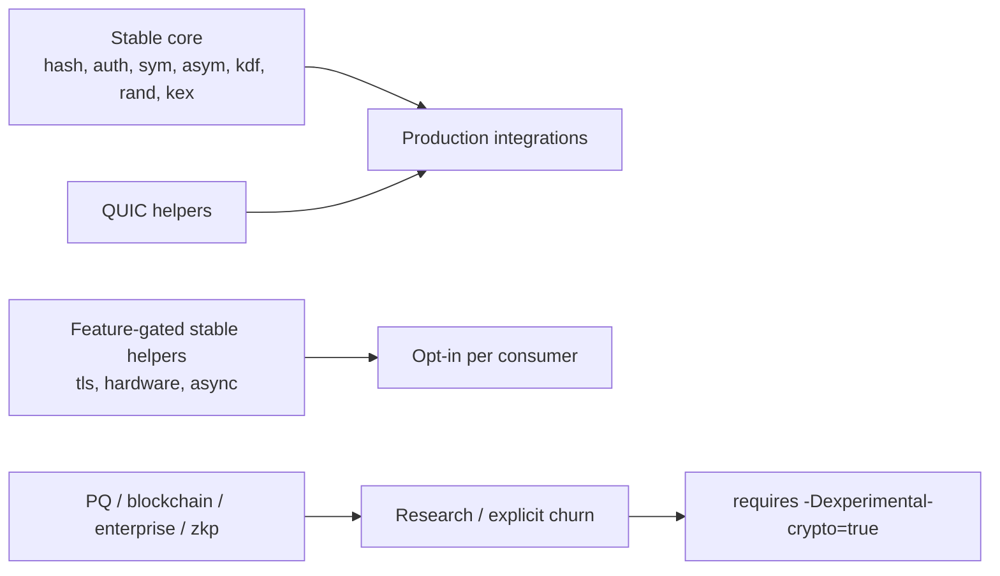

# Features Overview

zcrypto supports optional feature flags for modular compilation. Stable builds can stay close to the core feature set, while experimental cryptography requires explicit opt-in.

## Available Features

| Feature | Flag | Description | Size Impact |
|---------|------|-------------|-------------|
| **TLS/QUIC** | `tls` | TLS-related utilities and QUIC helpers | ~8MB |
| **Post-Quantum** | `post-quantum` | Experimental ML-DSA / ML-KEM APIs | ~5MB |
| **Hardware Acceleration** | `hardware-accel` | AES-NI, AVX2, SIMD optimizations | ~2MB |
| **Blockchain** | `blockchain` | Experimental blockchain helpers | ~3MB |
| **VPN** | `vpn` | WireGuard, IPsec, IKEv2 protocols | ~4MB |
| **WebAssembly** | `wasm` | WASM crypto operations | ~1MB |
| **Enterprise** | `enterprise` | Experimental HSM / analysis helpers | ~3MB |
| **Zero-Knowledge Proofs** | `zkp` | Experimental proof-system APIs | ~6MB |
| **Async Operations** | `async` | zsync-backed async integration helpers | ~2MB |

## Feature Dependencies

Some features have additional stability considerations:

- **async** → requires zsync dependency
- **async** → currently targets the std.Io-backed `zsync` surface (`Io`, `Future`, `Runtime`, runtime helpers)
- **tls** → can use hardware_accel for performance
- **blockchain** → can use zkp for advanced features
- **post-quantum** → requires `-Dexperimental-crypto=true`
- **blockchain** → requires `-Dexperimental-crypto=true`
- **enterprise** → requires `-Dexperimental-crypto=true`
- **zkp** → requires `-Dexperimental-crypto=true`



## Use Case Examples

### Embedded/IoT Device
```zig
// Minimal crypto for constrained devices
const zcrypto = b.lazyDependency("zcrypto", .{
    .target = target,
    .optimize = optimize,
    // Only essential primitives
    .tls = false,
    .@"post-quantum" = false,
    .@"hardware-accel" = false,
    .blockchain = false,
    .vpn = false,
    .wasm = false,
    .enterprise = false,
    .zkp = false,
    .async = false,
});
// Result: ~3MB binary
```

### Web Application
```zig
// TLS and async for web services
const zcrypto = b.lazyDependency("zcrypto", .{
    .target = target,
    .optimize = optimize,
    .tls = true,
    .@"async" = true,
    // Other features disabled
});
// Result: ~12MB binary
```

### Blockchain Research Node
```zig
// Full blockchain and ZKP support
const zcrypto = b.lazyDependency("zcrypto", .{
    .target = target,
    .optimize = optimize,
    .blockchain = true,
    .zkp = true,
    .@"experimental-crypto" = true,
    .@"hardware-accel" = true,
    // Core features
});
// Result: ~18MB binary
```

### VPN Server
```zig
// VPN protocols with hardware acceleration
const zcrypto = b.lazyDependency("zcrypto", .{
    .target = target,
    .optimize = optimize,
    .vpn = true,
    .@"hardware-accel" = true,
    .tls = true,
    // Core features
});
// Result: ~17MB binary
```

## Feature-Specific Documentation

- **[TLS/QUIC](tls.md)** - Transport security protocols
- Additional feature docs should be added only when they match the current implementation and examples.

## Build Configuration

See **[Build Configuration](../getting-started/build-config.md)** for detailed setup instructions.

## Performance Notes

- Hardware acceleration can improve performance by 2-10x
- Async operations add ~2MB but enable concurrent crypto
- Post-quantum algorithms are slower but future-proof
- ZKP operations are computationally intensive

## Stability Notes

- Core modules (hashing, symmetric, asymmetric primitives, KDF, random) are the
  intended stable surface, along with the QUIC crypto helpers.
- The standalone TLS 1.3 record/handshake stack is experimental and not
  interop-verified against external implementations. Use it as a building block,
  not a turnkey TLS endpoint.
- Post-quantum signatures use **ML-DSA-65 (FIPS 204)** and key exchange uses
  **ML-KEM-768 (FIPS 203)**, both stdlib-backed. **SLH-DSA (FIPS 205) is not
  provided** — there is no `std.crypto` backend and zcrypto does not ship a
  hand-rolled SPHINCS+.
- **RSA / RSA-PSS is unsupported.** TLS CertificateVerify returns
  `error.UnsupportedKeyType` for RSA keys.
- Experimental modules are available for research and iteration, but should not
  be treated as frozen production APIs.
- See [FIPS posture](../security/fips.md) for the full approved/experimental/
  unsupported breakdown.


