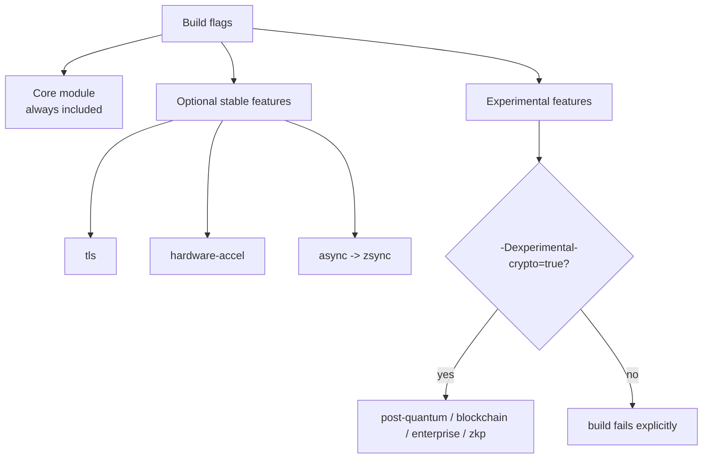

# Build Configuration

zcrypto v1.0.6 uses a **modular build system** that lets you include only the features you need. Experimental crypto families also require explicit opt-in.

## 🎯 Feature Flags

zcrypto uses build-time feature flags to enable/disable optional components:

```bash
# Enable only core crypto (minimal build)
zig build -Dtls=false -Dpost-quantum=false -Dhardware-accel=false

# Enable TLS + hardware acceleration (web server)
zig build -Dtls=true -Dhardware-accel=true -Dpost-quantum=false

# Enable experimental PQ support explicitly
zig build -Dpost-quantum=true -Dexperimental-crypto=true
```

## 📋 Available Feature Flags

| Flag | Default | Description | Impact |
|------|---------|-------------|---------|
| `tls` | `true` | TLS 1.3 and QUIC support | ~8KB |
| `post-quantum` | `false` | Experimental ML-KEM/ML-DSA algorithms | ~5KB |
| `hardware-accel` | `true` | SIMD/AES-NI optimizations | ~3KB |
| `blockchain` | `false` | Experimental blockchain helpers | ~4KB |
| `vpn` | `true` | VPN data-channel AEAD primitives (not a VPN protocol) | ~3KB |
| `wasm` | `true` | WebAssembly support | ~2KB |
| `enterprise` | `false` | Experimental HSM / analysis helpers | ~6KB |
| `zkp` | `false` | Experimental zero-knowledge proofs | ~7KB |
| `async` | `false` | Opt-in zsync async operations | ~4KB |



## 📊 Build Size Comparison

| Configuration | Binary Size | Compile Time | Use Case |
|---------------|-------------|--------------|----------|
| **Full Featured** | ~35MB | ~45s | Enterprise applications |
| **TLS + Hardware** | ~15MB | ~25s | Web servers, APIs |
| **Core Only** | ~8MB | ~12s | Embedded, IoT |
| **Post-Quantum** | ~12MB | ~18s | Future-proof crypto |

## 🔧 Usage in build.zig

### Basic Integration

```zig
// build.zig
const zcrypto = b.lazyDependency("zcrypto", .{
    .target = target,
    .optimize = optimize,
    // Enable only TLS and hardware acceleration
    .tls = true,
    .@"hardware-accel" = true,
    // Disable everything else
    .@"post-quantum" = false,
    .blockchain = false,
    .vpn = false,
    .wasm = false,
    .enterprise = false,
    .zkp = false,
    .@"async" = false,
});

const exe = b.addExecutable(.{
    // ...
    .imports = &.{
        .{ .name = "zcrypto", .module = zcrypto.module("zcrypto") },
    },
});
```

### Embedded Systems

```zig
// Minimal configuration for embedded
const zcrypto = b.lazyDependency("zcrypto", .{
    .target = target,
    .optimize = .ReleaseSmall,
    .tls = false,
    .@"post-quantum" = false,
    .@"hardware-accel" = false,
    .blockchain = false,
    .vpn = false,
    .wasm = false,
    .enterprise = false,
    .zkp = false,
    .@"async" = false,
});
```

### WebAssembly

```zig
// WASM-optimized build
const zcrypto = b.lazyDependency("zcrypto", .{
    .target = .{ .cpu_arch = .wasm32, .os_tag = .freestanding },
    .optimize = .ReleaseSmall,
    .tls = false,
    .@"post-quantum" = false,
    .@"hardware-accel" = false,
    .enterprise = false,
    .zkp = false,
});
```

## 📦 Module Structure

When features are enabled, they become available as submodules:

```zig
const zcrypto = @import("zcrypto");

// Core (always available)
const hash = zcrypto.hash;
const sym = zcrypto.sym;

// Features (only when enabled)
const tls = zcrypto.tls;           // TLS 1.3 + QUIC
const post_quantum = zcrypto.post_quantum;  // ML-KEM + ML-DSA
const hardware = zcrypto.hardware; // SIMD operations
// ... etc
```

## Consumer Decision Flow

```mermaid
flowchart TD
    start["New consumer"] --> need_tls{"Need TLS/QUIC helpers?"}
    need_tls -->|yes| tls["Enable .tls = true"]
    need_tls -->|no| notls["Set .tls = false for minimal builds"]

    start --> need_async{"Need zsync async wrappers?"}
    need_async -->|yes| async["Enable .@\"async\" = true"]
    need_async -->|no| noasync["Set .@\"async\" = false"]

    start --> need_pq{"Testing PQ/research APIs?"}
    need_pq -->|yes| pq["Enable feature + .@\"experimental-crypto\" = true"]
    need_pq -->|no| stable["Stay on stable core"]
```

## ⚠️ Important Notes

- **Core crypto is always included** - hash, symmetric crypto, basic primitives
- **Features are additive** - enabling a feature doesn't disable others
- **Experimental modules require opt-in** - `post-quantum`, `blockchain`, `enterprise`, and `zkp` also require `-Dexperimental-crypto=true`
- **Experimental is not stable-core** - those modules are for research and iteration in v1.0.6; keep production code on the stable core unless you intentionally opt into churn.
- **Dependencies are automatic** - zsync is only required when `async=true`
- **Cross-platform** - Feature detection works on all supported platforms
- **Feature-aware entrypoints** - disabled features no longer break the shipped demo/example targets

## 🔍 Build-Target Feature Detection

`HardwareAcceleration.detect()` reports the CPU features of the **build target**,
not of the machine running the code. It reads `builtin.cpu.features`, which is
fixed at compile time; it does not issue CPUID. A binary built with
`-Dcpu=baseline` reports no acceleration on a machine that has it, and a binary
built with `-Dcpu=native` reports the build host's features wherever it is later
copied — including machines that lack those instructions, where the result is a
SIGILL that no flag read can prevent.

```zig
// Build metadata, useful for logs and benchmark records.
const hw = zcrypto.hardware;
const features = hw.HardwareAcceleration.detect();
std.debug.print("built for aes={}, avx2={}\n", .{ features.aes_ni, features.avx2 });
```

There are no separate AES-NI entry points to branch to. Instruction selection is
done inside `std.crypto` at comptime from the same build target — for AES it
publishes the outcome as `std.crypto.core.aes.has_hardware_support`, which is
the value to record if you want to know what actually ran. Calling the ordinary
`zcrypto` API is what gets the accelerated code; branching on `detect()` cannot
add acceleration, only disagree about it.

## 🖥️ Deployment CPU Requirements

Because instruction selection happens at compile time, **the `-Dcpu` you build
with is the minimum CPU your binary requires**. This is a deployment decision,
not a tuning knob:

| Build | Minimum CPU to run it | AES backend |
| --- | --- | --- |
| `zig build` on the target host | that host's feature set | whatever that host supports |
| `zig build -Dcpu=x86_64` | any x86-64 | software (`aes/soft.zig`) |
| `zig build -Dcpu=native` | a CPU with every feature the build host has | the build host's |
| cross-compiled with `-Dtarget=...` and no `-Dcpu` | Zig's `baseline` for that target | software |

Two consequences that are easy to get wrong:

- **A native build is not portable.** Building on a modern host and copying the
  binary to an older machine produces `SIGILL` on the first instruction that
  machine lacks. Nothing in this library can catch that: the fault happens
  inside `std.crypto`, or in unrelated code the optimizer vectorized, before any
  `zcrypto` error path is reachable.
- **Reading feature flags does not protect you.** `detect()` reports what the
  binary was *built for*, so on a machine that cannot run that binary it either
  reports the build's features and is wrong about the host, or is never reached
  because the process has already died. There is no arrangement of runtime flag
  checks that makes an unsupported-instruction build safe; choose the right
  `-Dcpu` instead.

If you ship one binary to a mixed fleet, build for the oldest CPU in it. The
software AES path is substantially slower than the AES-NI one — measure the gap
on your own hardware with `HardwareCrypto.benchmarkAesGcm` rather than assuming
it, since it varies widely by microarchitecture and message size.

Both paths are covered by published known-answer vectors (GCM spec Appendix B,
RFC 8439, FIPS 180-4, RFC 5869). To check a specific target yourself:

```bash
# Generic x86-64: must select the software backend and still match the vectors.
zig build kat -Dcpu=x86_64 -Dexpect-aes-hardware=false

# Build host's features: must select the hardware backend.
zig build kat -Dcpu=native -Dexpect-aes-hardware=true
```

`-Dexpect-aes-hardware` asserts which backend the target actually selected, so a
run that silently built for the wrong CPU fails instead of reporting a pass for
a backend it never compiled.

## 🚀 Migration Guide

### From v0.8.x

```zig
// Old way (v0.8.x) - everything included
const zcrypto = @import("zcrypto");

// New way (v1.0.x) - selective features
const zcrypto = @import("zcrypto");
const tls = zcrypto.tls;  // Only available if -Dtls=true
```

### Conditional Feature Usage

```zig
// Safe feature usage with conditional compilation
const zcrypto = @import("zcrypto");

// Core features (always available)
const hash = zcrypto.hash.sha256(data);

// Optional features (check availability)
if (@import("builtin").is_test) {
    // In tests, all features are available
    const tls = zcrypto.tls;
} else {
    // In production, only enabled features are available
    // const tls = zcrypto.tls; // Compile error if -Dtls=false
}
```

## 🎯 Best Practices

1. **Start minimal** - Enable only what you need
2. **Profile regularly** - Measure binary size and performance
3. **Use feature flags** - Different builds for different deployment targets
4. **Test thoroughly** - Ensure all required features are verified in your local release checks

## 📞 Support

- **Issues**: [GitHub Issues](https://github.com/ghostkellz/zcrypto/issues)
- **Discussions**: [GitHub Discussions](https://github.com/ghostkellz/zcrypto/discussions)
