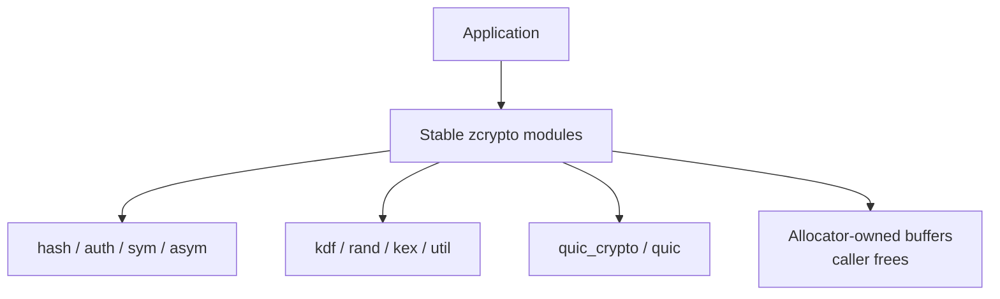
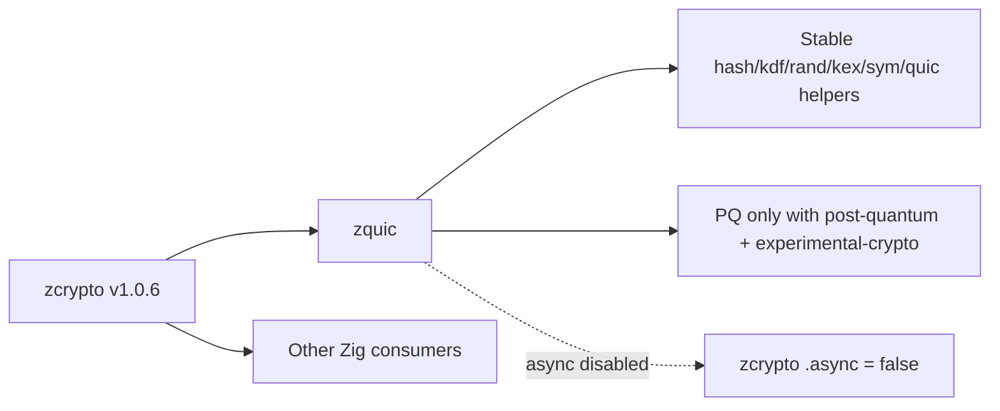

# Integration Guide

This guide covers the supported ways to integrate the `zcrypto v1.0.x` release line into another Zig project.

For non-Zig language bindings, use the current FFI surface only after verifying the bindings you need actually exist in the release you are consuming.

## Zig Projects

### Fetch the release

```bash
zig fetch --save https://github.com/ghostkellz/zcrypto/archive/refs/tags/v1.0.6.tar.gz
```

### Add the dependency

```zig
const zcrypto = b.lazyDependency("zcrypto", .{
    .target = target,
    .optimize = optimize,
    .tls = true,
    .@"hardware-accel" = true,
    .@"async" = false,
    .@"post-quantum" = false,
    .blockchain = false,
    .enterprise = false,
    .zkp = false,
});

exe.root_module.addImport("zcrypto", zcrypto.module("zcrypto"));
```

```mermaid
flowchart LR
    consumer["Consumer build.zig"] --> dep["b.lazyDependency(\"zcrypto\", flags)"]
    dep --> module["zcrypto.module(\"zcrypto\")"]
    module --> import["exe.root_module.addImport"]
    import --> code["@import(\"zcrypto\")"]
```

## Stable Integration Surface

Prefer these modules for stable `v1.0.x` integrations:

- `zcrypto.hash`
- `zcrypto.sym`
- `zcrypto.asym`
- `zcrypto.kdf`
- `zcrypto.rand`
- `zcrypto.util`
- `zcrypto.kex`
- `zcrypto.quic_crypto`
- `zcrypto.quic`



## Feature-Gated Integrations

- `zcrypto.tls` requires `-Dtls=true`
- `zcrypto.hardware` requires `-Dhardware-accel=true`
- `zcrypto.async_crypto` requires `-Dasync=true`

## Experimental Feature Policy

The following feature families are available, but are not part of the stable core contract for `v1.0.x`:

- `post-quantum`
- `blockchain`
- `enterprise`
- `zkp`

To enable them, set both the feature flag and:

```bash
-Dexperimental-crypto=true
```

Example experimental build:

```bash
zig build -Dpost-quantum=true -Dexperimental-crypto=true
```

## Local Verification

Use the repository scripts before cutting or consuming a release:

```bash
bash dev/release_check.sh
bash dev/experimental_pq_check.sh
```

## Notes

- Prefer release tags over `main` tarballs for reproducibility.
- If you depend on experimental modules, expect more churn than the stable core API.

## Downstream Compatibility Notes For v1.0.6

- `zquic` and other QUIC consumers should prefer `zcrypto.quic_crypto`, `zcrypto.quic`, `zcrypto.kdf`, `zcrypto.sym`, `zcrypto.hash`, `zcrypto.rand`, and `zcrypto.util` for stable integrations.
- Async consumers should use `zcrypto.async_crypto` only with `-Dasync=true`; the integration targets the std.Io-backed `zsync v0.8.4` runtime shape.
- Post-quantum consumers must opt in with both `-Dpost-quantum=true` and `-Dexperimental-crypto=true`; ML-KEM and ML-DSA wrappers remain experimental even when backed by Zig stdlib primitives.
- FFI consumers should query runtime capabilities instead of assuming optional feature symbols are present.
- RSA/RSA-PSS and SLH-DSA remain unsupported in v1.0.6 unless an audited backend is added in a later release.


