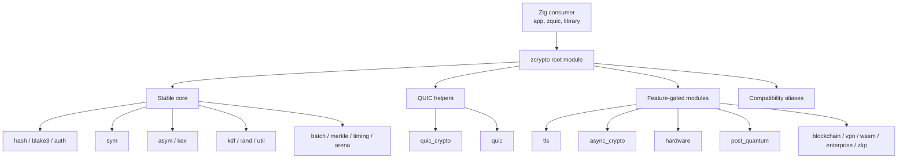
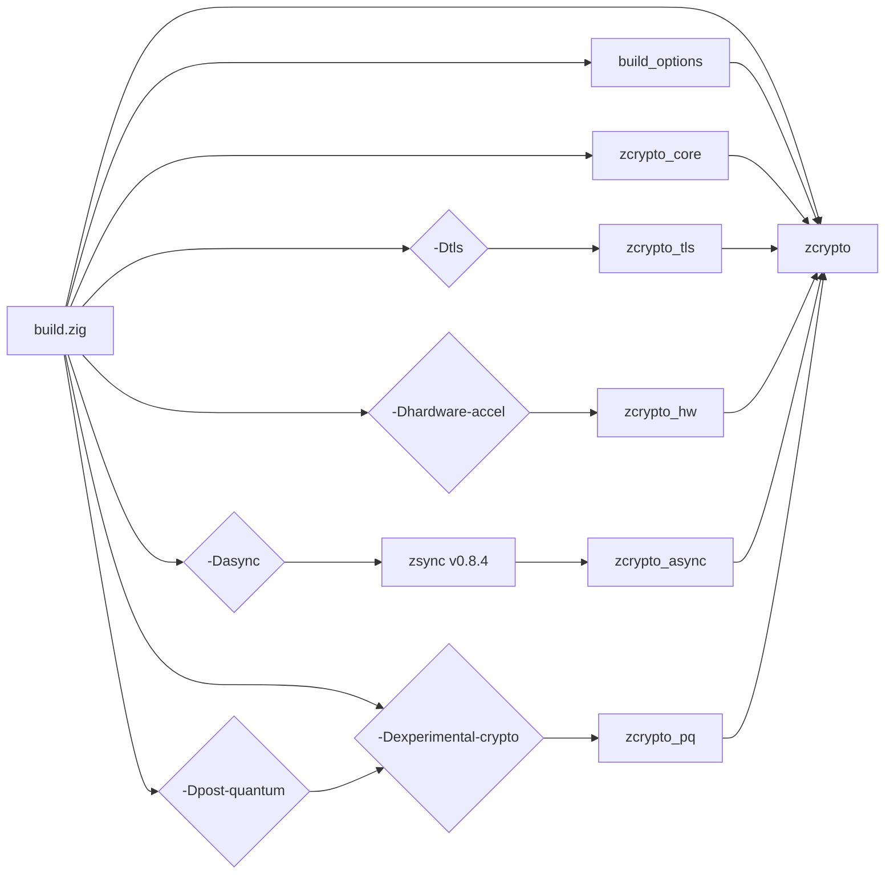
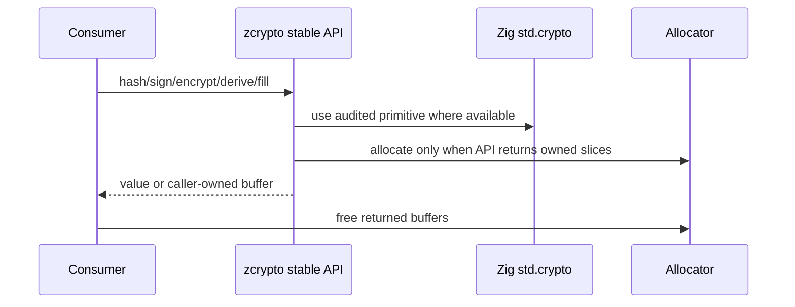
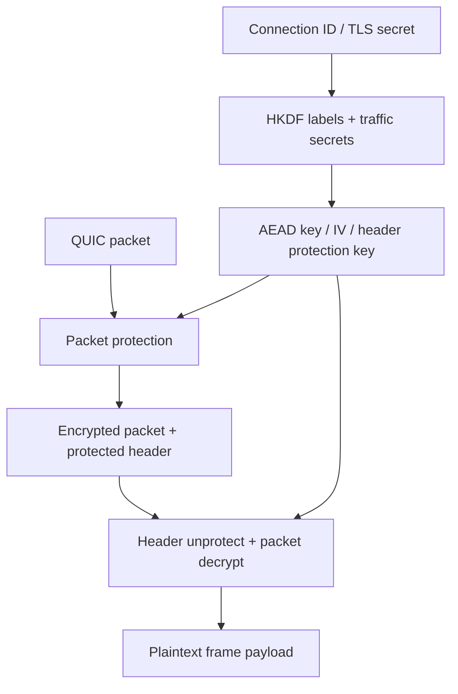
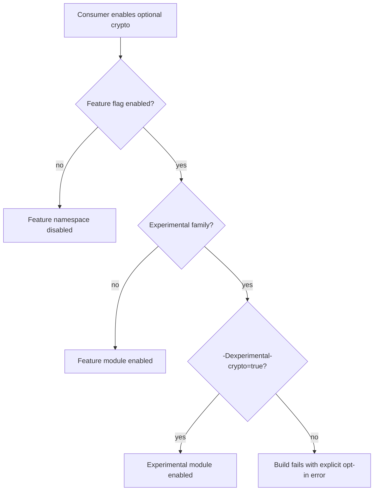
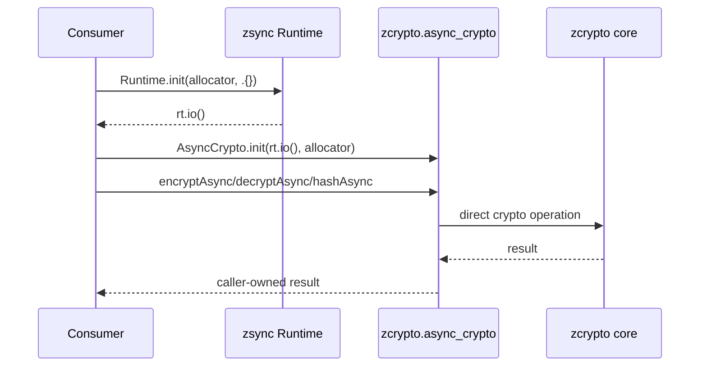
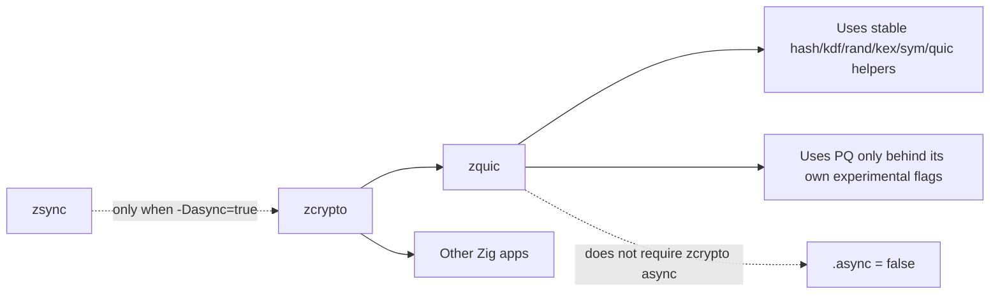

# Architecture

This document describes zcrypto's package structure, build-time feature model,
and the main data flows that matter to downstream consumers.

## High-Level Overview

## Build Graph

zcrypto uses `build.zig` feature flags to include only the requested modules and
to gate experimental surfaces.

## Stable API Flow

Stable core APIs are thin, explicit wrappers around Zig standard-library crypto
or locally verified helpers. Allocator-taking functions return caller-owned
buffers unless a returned type documents `deinit`.

## QUIC Crypto Flow

QUIC consumers such as zquic rely on zcrypto for stable primitives and packet
protection helpers.

## Experimental Gate

Experimental crypto is intentionally explicit. The feature flag alone is not
enough for PQ, blockchain, enterprise/formal, or ZKP code.

## Async Integration

The async feature integrates with zsync while keeping zquic and other consumers
free to disable it.

## Downstream Boundary

zcrypto should remain easy to consume from libraries that already own their
runtime and protocol stack.

